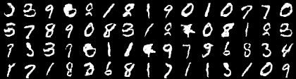
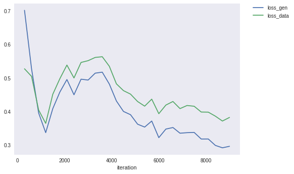

# DCGANs-for-MNIST
Implementation of [DC-GANs](https://arxiv.org/pdf/1511.06434.pdf) on MNIST dataset using [Chainer](https://arxiv.org/pdf/1511.06434.pdf) framework. 

## Result after 30 epochs

## Loss Behaviour

